# PaperLink 系统架构图

```mermaid
graph TB
    subgraph Frontend["Frontend (port 8001)"]
        UI["index.html<br/>单文件 SPA"]
        KG["kg.html<br/>知识图谱"]
        PL["pipeline.html<br/>RAG 追踪"]
        WM["watch.html<br/>Agent 监控"]
    end

    subgraph API["FastAPI (api.py)"]
        direction TB
        RT["/create_topic<br/>关键词提取"]
        SP["/search_papers<br/>12 源并行搜索"]
        ASK["/ask<br/>RAG 问答 SSE"]
        AG["/agent/*<br/>LangGraph ReAct"]
        KGE["/kg_data<br/>图谱数据"]
        EX["/export<br/>Markdown 报告"]
    end

    subgraph Search["搜索层 (search.py)"]
        direction LR
        AX["arXiv"]
        OA["OpenAlex"]
        S2["Semantic Scholar"]
        CR["Crossref"]
        CO["CORE"]
        DJ["DOAJ"]
        EP["Europe PMC"]
        PM["PubMed"]
        PW["PapersWithCode"]
        GS["Google Scholar"]
        CK["CNKI"]
    end

    subgraph RAG["RAG 引擎"]
        direction TB
        QE["查询理解<br/>qa_engine.py"]
        HR["自适应混合检索<br/>hybrid_retriever.py"]
        KB["知识库<br/>knowledge_base.py<br/>LanceDB"]
        DL["PDF 处理<br/>downloader.py"]
    end

    subgraph Agent["Agent 系统"]
        LG["LangGraph<br/>langgraph_workflow.py"]
        TL["工具注册表<br/>tool_registry.py"]
        MM["对话记忆<br/>conversation_memory.py"]
    end

    subgraph Infra["基础设施"]
        CF["config.py<br/>环境变量"]
        MN["monitor.py<br/>指标+安全"]
        AU["auth.py<br/>JWT"]
        TM["topic_manager.py<br/>状态持久化"]
    end

    UI --> RT
    UI --> SP
    UI --> ASK
    UI --> AG
    KG --> KGE
    PL --> ASK
    WM --> AG

    RT --> Search
    SP --> Search
    ASK --> QE
    QE --> HR
    HR --> KB
    KB --> DL
    KB --> LanceDB[(LanceDB<br/>向量+BM25)]

    AG --> LG
    LG --> TL
    LG --> MM
    TL --> Search
    TL --> ASK

    KB --> MN
    ASK --> MN
    SP --> CF

    style Search fill:#1a1a2e,stroke:#5b6af0
    style RAG fill:#1a1a2e,stroke:#4ca15c
    style Agent fill:#1a1a2e,stroke:#c98a26
    style Frontend fill:#1a1a2e,stroke:#e0e0e0
    style API fill:#1a1a2e,stroke:#d94f4f
    style Infra fill:#1a1a2e,stroke:#6b6b6b
```



## 核心数据流

```
用户输入 "计算机视觉"
  → /create_topic (LLM翻译CN→EN: "computer vision")
  → /search_papers/stream (12源并行, SSE分批返回 159篇)
  → 用户点击论文预览
  → 用户提问 "什么是CV"
  → /ask
    → _classify_intent → "定义" (跳过重排)
    → _resolve_coreference (多轮消解)
    → _expand_query (长问题改写)
    → _validate_expansion (cos≥0.75)
    → AdaptiveHybridRetriever.search
      → _compute_adaptive_weight (短查询→BM25权重高)
      → _vector_recall + _bm25_recall (宽召回 8x)
      → _adaptive_rrf (动态权重融合)
      → _cascade_rerank (MiniLM→bge-reranker)
    → DeepSeek 生成 (带引用+补充线索)
  → SSE 流式返回答案
```

## 技术栈一览

| 层 | 技术 | 说明 |
|---|------|------|
| LLM | DeepSeek v4-pro | 生成、翻译、查询改写 |
| Embedding | BAAI/bge-small-zh (512d) | CPU 推理, 0.1s/条 |
| Rerank | bge-reranker-base + all-MiniLM-L6-v2 | 级联 2 阶段 |
| 向量库 | LanceDB | 嵌入式, BM25+向量+元数据 |
| Agent | LangGraph StateGraph | 条件边+循环+断点续跑 |
| 后端 | FastAPI + uvicorn | 25 端点, 全异步 |
| 前端 | 单文件 HTML/CSS/JS | 零构建, 5 可视化页 |
| 部署 | Docker / docker-compose | 2C4G 无 GPU |
